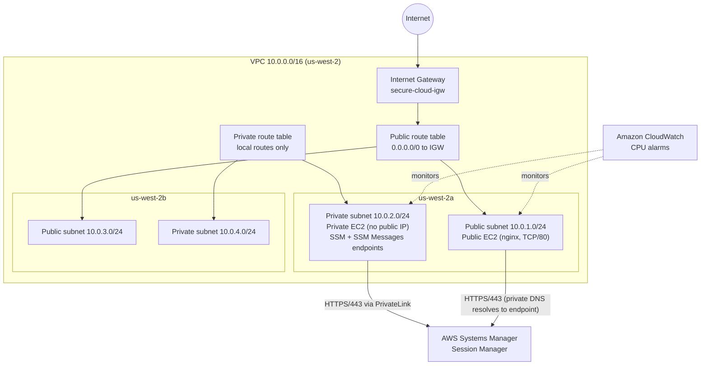
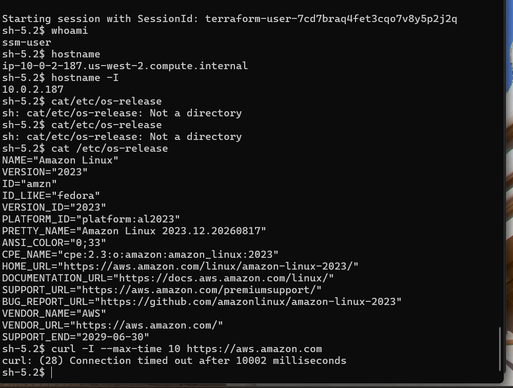
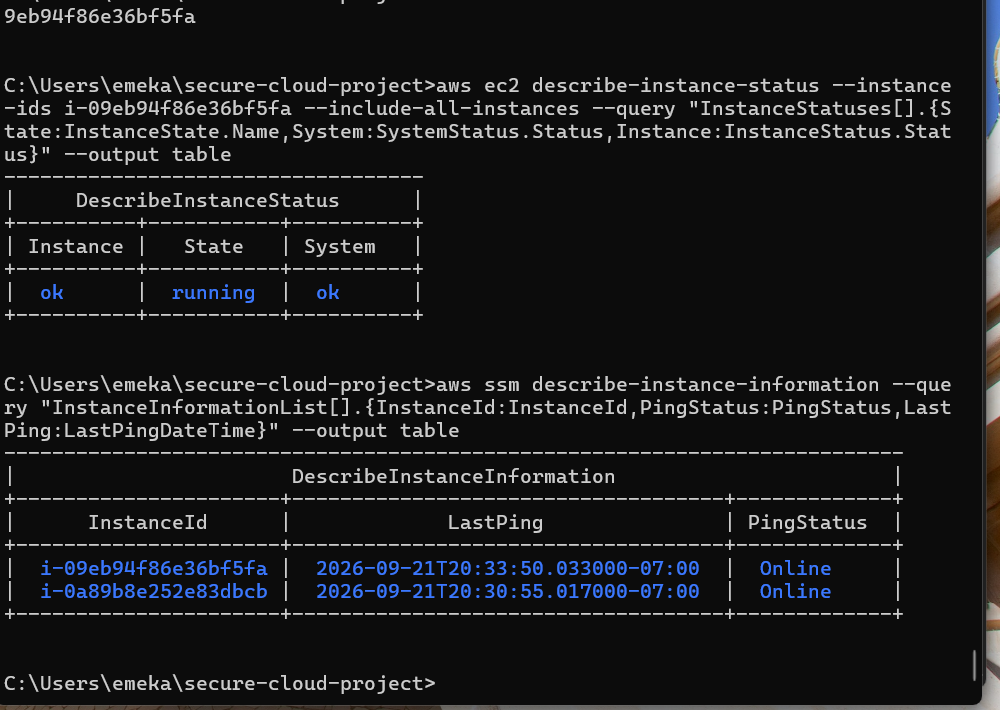
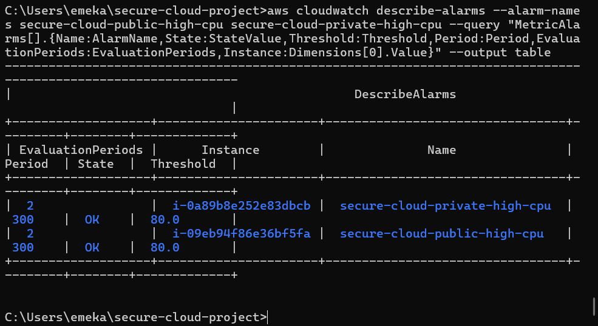
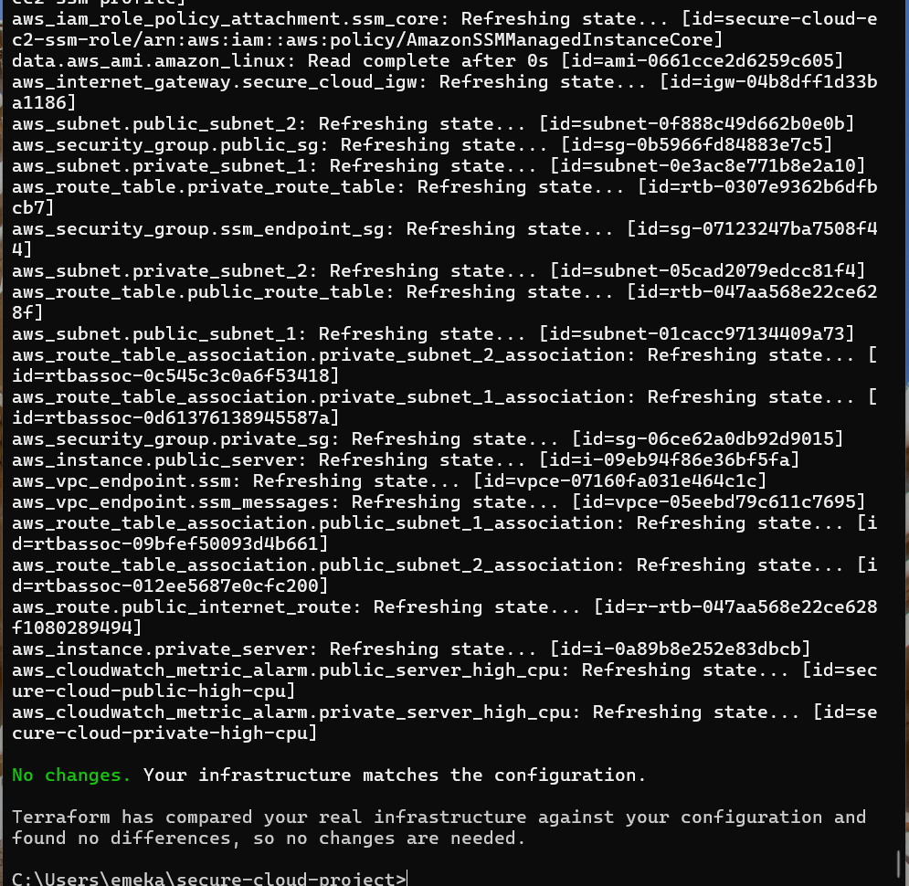
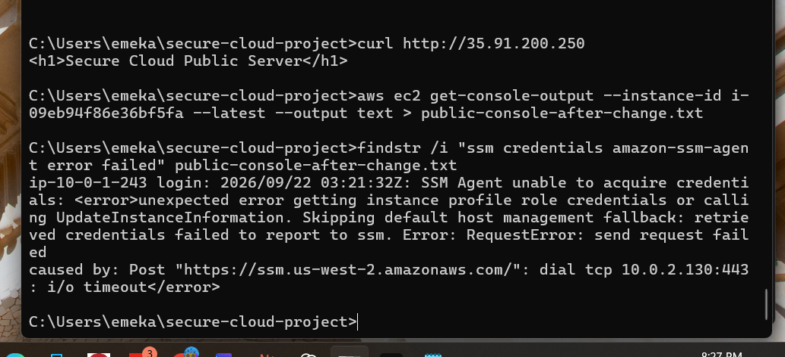
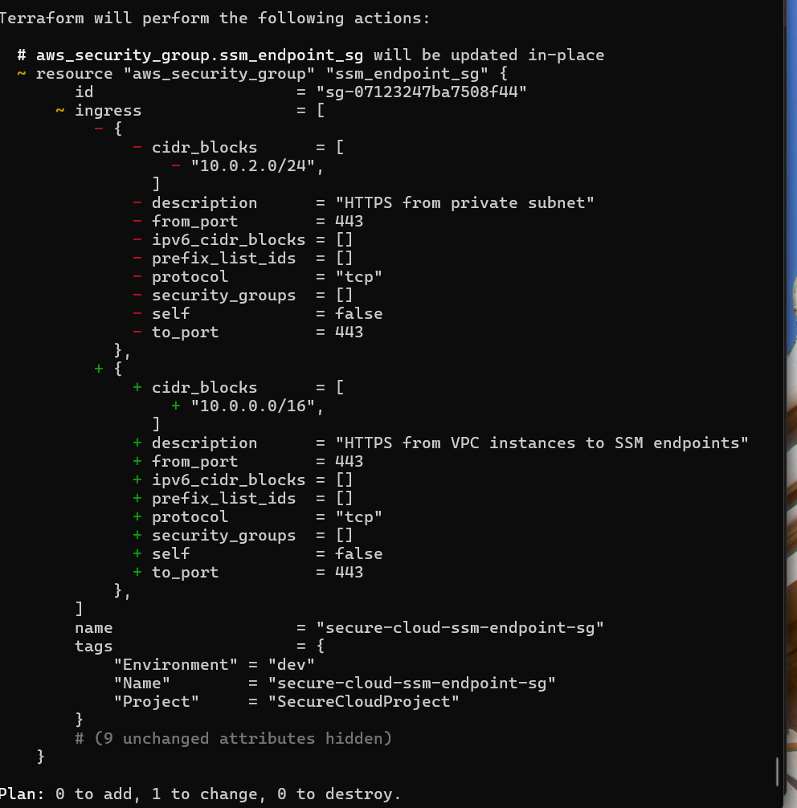

# Secure Cloud Infrastructure on AWS with Terraform


## Overview

This project provisions a segmented AWS environment in `us-west-2` using Terraform. It separates an Internet-facing web tier from an isolated private tier, administers both EC2 instances through AWS Systems Manager Session Manager instead of SSH, keeps management traffic for the private tier on interface VPC endpoints (AWS PrivateLink), and monitors both hosts with CloudWatch CPU alarms.

The build was validated end to end with the AWS CLI and Terraform, and it includes a documented troubleshooting case where the public instance lost Systems Manager connectivity because of a VPC endpoint security group rule. The fix was made in Terraform, and the final `terraform plan` reported that the live infrastructure matched the configuration.

## Architecture



| Component | Configuration |
|---|---|
| VPC | `10.0.0.0/16`, DNS support and DNS hostnames enabled |
| Public subnets | `10.0.1.0/24` (us-west-2a), `10.0.3.0/24` (us-west-2b), associated with the public route table |
| Private subnets | `10.0.2.0/24` (us-west-2a), `10.0.4.0/24` (us-west-2b), associated with a private route table that has no Internet route |
| Internet Gateway | Attached to the VPC; `0.0.0.0/0` route exists only in the public route table |
| Public EC2 | Amazon Linux 2023, `t3.micro`, public IP, nginx installed through `user_data`, SSM Agent enabled |
| Private EC2 | Amazon Linux 2023, `t3.micro`, private subnet, no public IP |
| Public security group | Inbound HTTP/80 from the Internet; outbound allowed |
| Private security group | Inbound TCP/8080 only from the public security group |
| SSM endpoint security group | Inbound HTTPS/443 from the VPC CIDR `10.0.0.0/16` |
| Interface VPC endpoints | `com.amazonaws.us-west-2.ssm` and `com.amazonaws.us-west-2.ssmmessages`, private DNS enabled |
| IAM | `secure-cloud-ec2-ssm-role` (trusted by EC2) with `AmazonSSMManagedInstanceCore`, attached through `secure-cloud-ec2-ssm-profile` |
| CloudWatch | `secure-cloud-public-high-cpu` and `secure-cloud-private-high-cpu`: CPUUtilization > 80%, 300 second period, 2 evaluation periods |

The two us-west-2b subnets are provisioned for capacity and future workloads; the running instances and endpoints are in us-west-2a.

## Security Design

- **Private tier with no public IP.** The private EC2 instance sits in a subnet whose route table has no Internet Gateway route, so it has no general Internet path.
- **No SSH exposure required.** Neither security group opens port 22. Administration is done through Systems Manager Session Manager, which also removes the need to manage SSH key pairs.
- **IAM instance role.** EC2 instances get permissions through an instance profile and role scoped to the AWS managed `AmazonSSMManagedInstanceCore` policy. No credentials are stored on the hosts.
- **Separate operator permissions.** The Terraform/CLI identity was not given blanket `ssm:*` access. `ssm:StartSession` was granted for the project's instances and the standard `SSM-SessionManagerRunShell` document, plus `ResumeSession`/`TerminateSession`.
- **Private AWS service access.** Interface VPC endpoints for `ssm` and `ssmmessages` let the private instance reach Systems Manager without a NAT gateway or Internet route.
- **Security group segmentation.** The private tier only accepts application traffic (TCP/8080) from the public tier's security group, and the endpoint security group only accepts HTTPS from inside the VPC.
- **IMDSv2.** Instance metadata is set to `http_tokens = required` on both instances (the Amazon Linux 2023 AMI default), verified during troubleshooting.

## Infrastructure as Code

All resources are defined in [`main.tf`](main.tf) and managed with Terraform (AWS provider `~> 6.0`, locked in [`.terraform.lock.hcl`](.terraform.lock.hcl)).

Workflow used:

```bash
terraform init
terraform fmt
terraform validate
terraform plan
terraform apply
terraform output
terraform plan   # final drift check
```

[`outputs.tf`](outputs.tf) exposes the VPC ID, public and private instance IDs, instance IP addresses, and the SSM and SSM Messages endpoint IDs, so operators can retrieve key identifiers without manual console lookups.

**AMI pinning.** Both instances are pinned to the tested Amazon Linux 2023 AMI rather than using the `most_recent` AMI data source directly. When the dynamic data source was tested, Terraform proposed replacing both instances, so the change was reverted to avoid unnecessary instance churn. The data source is kept in the configuration for reference and controlled upgrades.

## Validation

| Check | Result |
|---|---|
| Public web tier | `curl http://<public-ip>` returned the nginx page `Secure Cloud Public Server` |
| Private tier via SSM | Session Manager shell opened as `ssm-user` on `10.0.2.187`, Amazon Linux 2023 |
| Private tier isolation | `curl -I --max-time 10 https://aws.amazon.com` timed out from the private instance |
| Public tier via SSM | Session Manager shell opened as `ssm-user` on `10.0.1.243`; `amazon-ssm-agent` and `nginx` both `active` |
| Systems Manager | Both instances reported `PingStatus: Online` |
| CloudWatch | Both CPU alarms in `OK` state with threshold 80, period 300, evaluation periods 2 |
| Terraform | Final plan: `No changes. Your infrastructure matches the configuration.` |

Selected evidence:

| | |
|---|---|
|  |  |
| Private instance: SSM shell, Amazon Linux 2023, outbound curl timeout | Both instances Online in Systems Manager after the fix |
|  |  |
| CloudWatch CPU alarms for both instances | Final Terraform plan: no changes |

## Troubleshooting Case Study

Several real issues came up during the build:

1. **IAM `CreateRole` AccessDenied.** Terraform could not initially create the SSM role. The Terraform user's policy was expanded only for the project's IAM role, instance profile, and `iam:PassRole`, instead of granting `AdministratorAccess`.
2. **Session Manager `StartSession` AccessDenied.** The user could view managed node status but could not open a session. Scoped Session Manager permissions were added rather than `ssm:*`.
3. **Missing Windows plugin.** After authorization succeeded, the workstation returned `SessionManagerPlugin is not found`. The AWS Session Manager Plugin was installed and verified.
4. **Public instance SSM `ConnectionLost`.** Detailed below.

### Public EC2 lost Systems Manager connectivity

**Symptom.** The public EC2 instance was healthy and serving HTTP, but Systems Manager reported `ConnectionLost`.

**Investigation.** Checked in sequence: instance running with system and instance status checks OK, public route table sending `0.0.0.0/0` to the Internet Gateway, public security group egress, IAM instance profile attached, profile containing `secure-cloud-ec2-ssm-role`, `AmazonSSMManagedInstanceCore` attached to the role, IMDSv2 enabled, and SSM Agent installed.

**Evidence.** EC2 console output showed the SSM Agent timing out on TCP 443 when posting to `https://ssm.us-west-2.amazonaws.com/`, which resolved to a private interface endpoint address in `10.0.2.0/24`.



**Root cause.** Because private DNS was enabled on the interface endpoints, the public instance (`10.0.1.243`) also resolved the regional SSM hostname to the endpoint. The endpoint security group only allowed HTTPS from `10.0.2.0/24`, which included the private instance but excluded the public subnet `10.0.1.0/24`. That explained the asymmetric behavior: the private host worked, the public host timed out.

**Resolution.** Updated the endpoint security group in Terraform to allow HTTPS from the VPC CIDR `10.0.0.0/16`. Terraform planned an in-place change (0 add, 1 change, 0 destroy), the change was applied, and the public instance was restarted.



**Result.** Both instances returned to `Online` in Systems Manager, and a Session Manager shell to the public server confirmed `ssm-user`, `10.0.1.243`, `amazon-ssm-agent` active, and `nginx` active.

The fix lives in configuration rather than as a console-only change, so future deployments inherit the corrected rule.

## Technologies

AWS, Terraform, Amazon EC2, Amazon VPC, AWS IAM, AWS Systems Manager (Session Manager), AWS PrivateLink / interface VPC endpoints, Amazon CloudWatch, Amazon Linux 2023, nginx, AWS CLI, Windows, Infrastructure as Code, networking, IAM least privilege concepts.

## Project Documentation

The full case study with architecture, CLI evidence, and the troubleshooting timeline is in [`docs/Secure_Cloud_AWS_Terraform_Portfolio_Case_Study.pdf`](docs/Secure_Cloud_AWS_Terraform_Portfolio_Case_Study.pdf).

## Key Takeaways

- Separating public and private tiers with route tables and security groups limits what is reachable from the Internet.
- Session Manager with interface VPC endpoints allows private workloads to be administered without SSH or an Internet route.
- Instance permissions (EC2 role) and operator permissions (human IAM user) are separate controls and fail in different ways.
- Enabling private DNS on an interface endpoint changes name resolution for every subnet in the VPC, so the endpoint security group must allow every client that will use it.
- Working through the stack in order (compute, routing, IAM, metadata, agent, then network path) isolated the fault without rebuilding the instance.
- Terraform state and a clean final plan confirm that the deployed environment matches the code.
- CloudWatch alarms give basic visibility into sustained CPU load on both tiers.

## Repository Structure

```
.
├── README.md
├── main.tf                 # VPC, subnets, routing, security groups, EC2, IAM, VPC endpoints, CloudWatch
├── outputs.tf              # Key infrastructure identifiers
├── .terraform.lock.hcl     # Provider version lock
├── .gitignore              # Excludes state, .terraform/, tfvars, keys, env files
├── docs/
│   └── Secure_Cloud_AWS_Terraform_Portfolio_Case_Study.pdf
└── screenshots/
```

Terraform state files, the `.terraform/` directory, and credentials are intentionally excluded from this repository.
